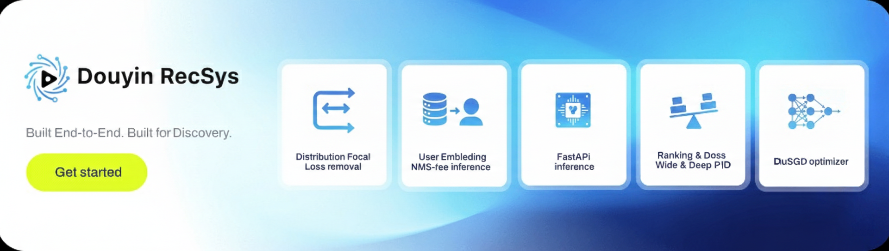
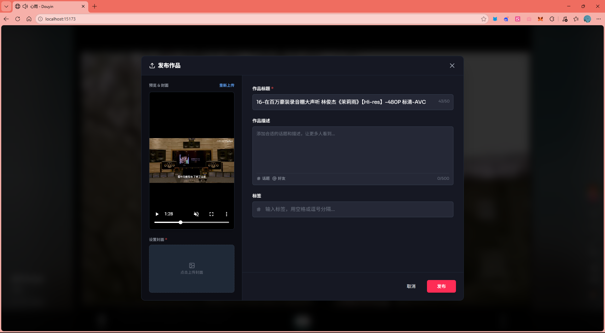
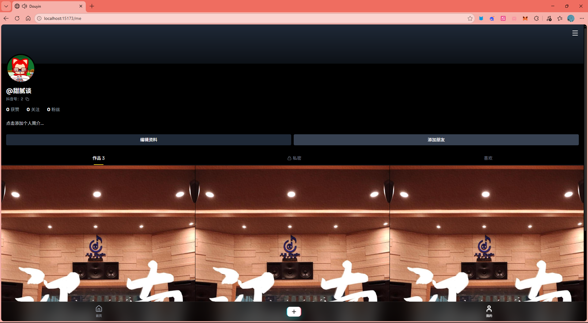

# Douyin (TikTok Clone)


基于微服务架构的高性能短视频平台 MVP，具备个性化推荐系统、高效的视频上传机制以及现代化的用户界面。

## 功能特性

- **个性化推荐 Feed 流**：基于用户行为（点赞、完播、分享）的多阶段推荐引擎（召回 -> 排序）。
- **智能上传**：
  - 分片上传，保证大文件传输稳定性。
  - 支持断点续传。
  - 文件哈希秒传，极大提升用户体验。
- **交互式 UI**：沉浸式全屏视频播放体验，支持点赞、分享、评论等交互。
- **用户体系**：完整的用户个人主页、观看历史记录及兴趣建模。

## 技术栈

### 前端
- **框架**：React 18 + Vite
- **样式**：TailwindCSS
- **图标**：Lucide React
- **路由**：React Router

### 后端 (核心服务)
- **框架**：Spring Boot (Java)
- **数据库**：MySQL (元数据存储), Redis (热点数据/缓存)
- **消息队列**：RabbitMQ (事件异步处理)
- **对象存储**：MinIO / 本地文件系统

### 推荐服务
- **框架**：FastAPI (Python)
- **机器学习框架**：PyTorch
- **向量数据库**：Milvus (向量检索)
- **算法模型**：
  - 双塔架构 (Two-Tower Architecture) 用于生成用户/视频向量。
  - 多路召回策略 (热门召回、标签召回、向量召回)。

## 系统架构


## 项目截图

### 首页 Feed 流

*沉浸式视频流，支持无限滚动加载。*

### 视频上传

*分片上传界面，实时显示上传进度。*

### 用户主页

*用户个人主页，展示上传作品及获赞数据。*

## 快速开始

### 前置要求
- Node.js & npm/pnpm
- Java JDK 17+
- Python 3.9+
- Docker & Docker Compose

### 1. 基础设施搭建
使用 Docker Compose 启动所需中间件 (MySQL, Redis, Milvus, MinIO, RabbitMQ)：
```bash
docker-compose up -d
```

### 2. 后端服务启动
```bash
cd backend
# 请先在 application.yml 中配置数据库连接信息
mvn spring-boot:run
```

### 3. 推荐服务启动
```bash
cd recommend
# 安装依赖
pip install -r requirements.txt
# 启动 FastAPI 服务
python main.py
```
*服务默认运行在 http://localhost:18101*

### 4. 前端应用启动
```bash
cd frontend
# 安装依赖
npm install
# 启动开发服务器
npm run dev
```

## 项目结构

- `frontend/`: 基于 React 的 Web 前端应用。
- **backend/**: 核心业务逻辑与 API 网关 (Spring Boot)。
- `recommend/`: 推荐算法与向量服务 (FastAPI)。
- `docker-compose.yml`: 基础设施编排文件。
- `scripts/`: 实用脚本工具。

## 文档资源

更详细的开发文档请参考：
- [开发指南](开发.md)
- `recommend/README.md`
