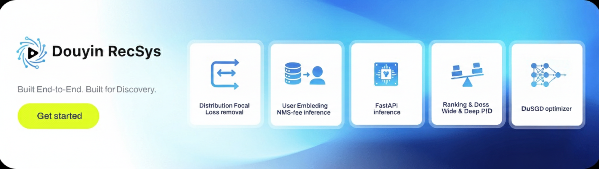
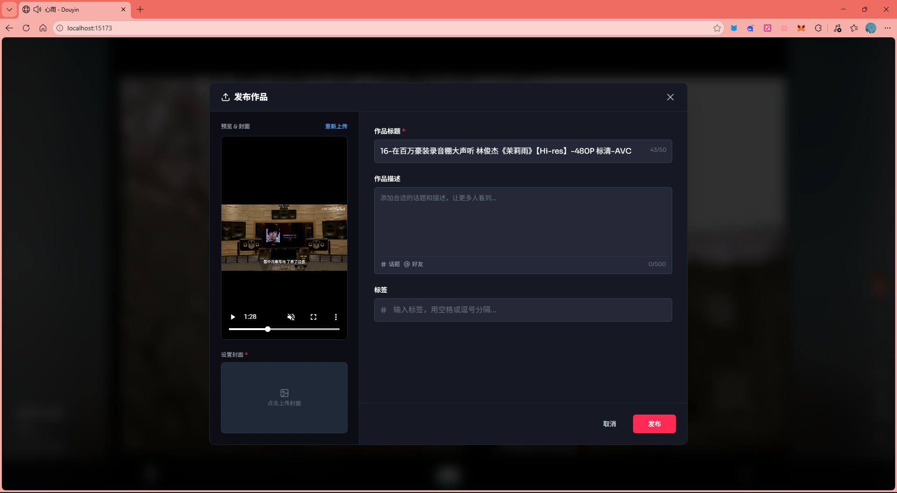
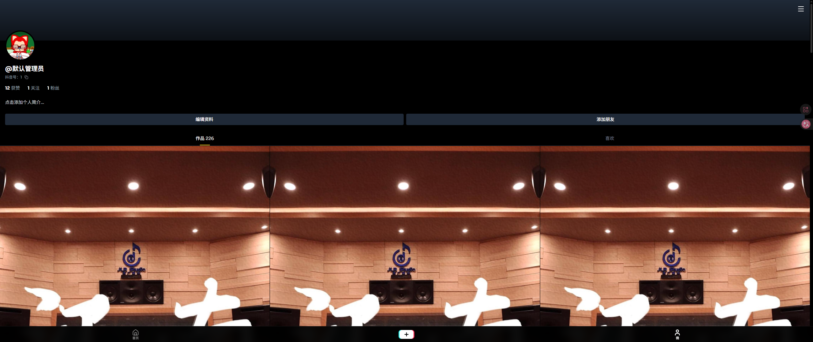
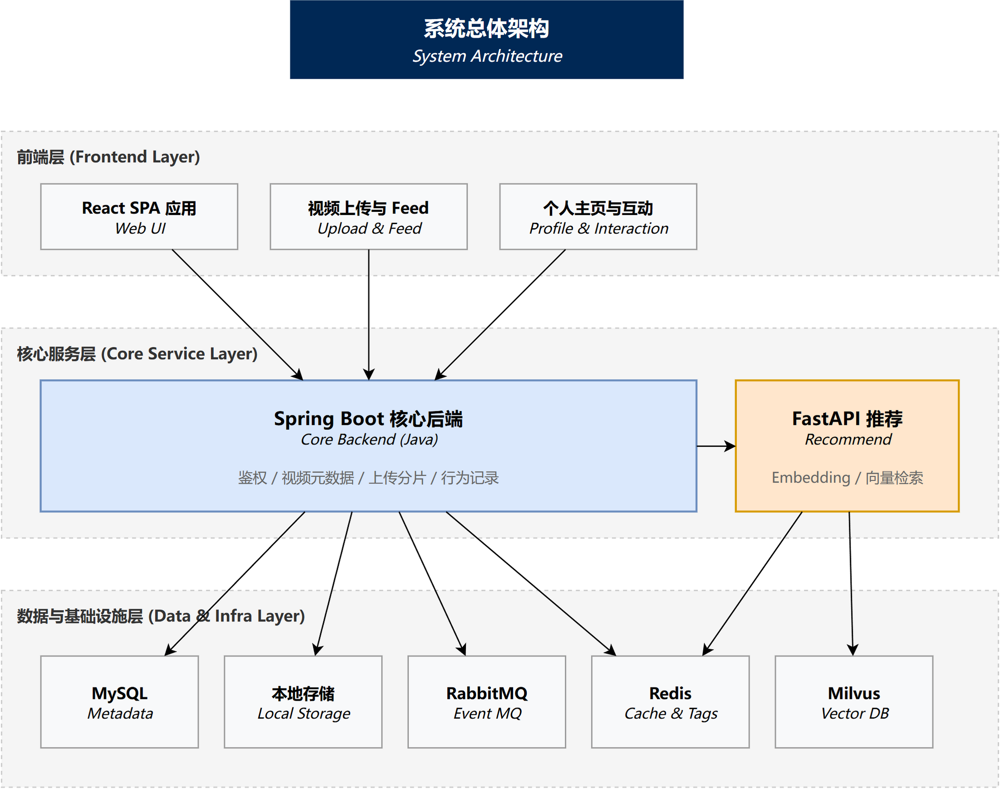
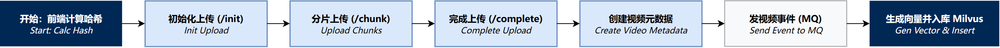

# Douyin



一个面向短视频场景的 MVP 项目，包含上传发布、Feed 浏览、行为上报、推荐向量链路和注册冷启动兴趣建模。

## 核心功能展示

### 1. 沉浸式 Feed 推荐流

结合热门召回与向量召回，提供沉浸式的短视频浏览体验。点赞操作基于 `user_video_relations` 真相表实现严格幂等。


### 2. 视频上传与发布

支持大文件分片上传、断点续传及秒传。发布后写入元数据并异步生成 embedding 入库 Milvus。



### 3. 个人主页与兴趣冷启动

新用户可选择标签，系统使用管理员已发布视频的标签向量均值初始化兴趣向量，解决冷启动问题。



## 技术栈

- 前端：React 18、Vite、TailwindCSS、React Router、Lucide React
- 后端：Spring Boot 3、MyBatis-Plus、MySQL、Redis、RabbitMQ、Milvus SDK
- 推荐：FastAPI、PyTorch、Pydantic v2、Redis、Milvus、DashScope
- 基础设施：Docker Compose、MySQL、Redis、RabbitMQ、Milvus、Attu

## 系统架构



## 核心数据流

### 视频上传与发布



1. 前端计算文件哈希
2. 调用 `POST /api/videos/upload/init` 初始化上传
3. 分片上传 `POST /api/videos/upload/chunk`
4. 完成上传 `POST /api/videos/upload/complete`
5. 创建视频 `POST /api/videos`
6. backend 发送 `event.video_embedding` 到 RabbitMQ
7. `VideoEmbeddingConsumer` 调用 recommend：
   - `/api/embedding/video` 生成向量
   - `/api/embedding/video/insert` 写入 Milvus
8. 视频通过后可从 `REVIEW` 自动切换到 `PUBLISHED`

### 注册冷启动兴趣向量


1. 前端调用 `GET /api/auth/register/tags` 获取管理员已发布视频标签
2. 用户在注册页勾选感兴趣标签
3. backend 注册时读取 Redis 中的 `recommend:tag:vectors`
4. 对用户所选标签的向量做算术平均
5. 将结果写入 recommend/Milvus，作为用户初始兴趣向量

### 标签向量预计算

1. backend 定时任务扫描管理员已发布视频
2. 调用 recommend `/api/embedding/video/query` 查询已存储视频向量
3. 按标签分组，对每个标签下的视频向量求平均
4. 将结果写入 Redis Hash：`recommend:tag:vectors`

## 目录结构

```text
Douyin/
|-- backend/
|-- frontend/
|-- recommend/
|-- scripts/
|-- storage/
|-- docs/
|-- docker-compose.yml
`-- README.md
```

## 环境要求

- Node.js 18+
- npm 9+
- Java 17+
- Maven 3.9+
- Python 3.9+
- Docker + Docker Compose

## 快速开始

### 1. 启动基础设施

```bash
docker-compose up -d
```

默认会启动：

- MySQL
- Redis
- RabbitMQ
- Milvus
- Attu

数据库初始化脚本会自动执行 `scripts/schema.sql`。

### 2. 启动 recommend

```bash
pip install -r recommend/requirements.txt
python recommend/main.py
```

服务默认地址：`http://localhost:8082`

### 3. 启动 backend

```bash
mvn -f backend/pom.xml spring-boot:run
```

服务默认地址：`http://localhost:8081`

Swagger：`http://localhost:8081/swagger-ui/index.html`

### 4. 启动 frontend

```bash
npm install --prefix frontend
npm run dev --prefix frontend
```

Vite 默认会输出本地访问地址。

## 常用开发命令

### backend

```bash
mvn -f backend/pom.xml clean install
mvn -f backend/pom.xml test
mvn -f backend/pom.xml spring-boot:run
```

### recommend

```bash
pip install -r recommend/requirements.txt
python recommend/main.py
pytest recommend
python -m compileall recommend/app
```

### frontend

```bash
npm install --prefix frontend
npm run dev --prefix frontend
npm run build --prefix frontend
```
